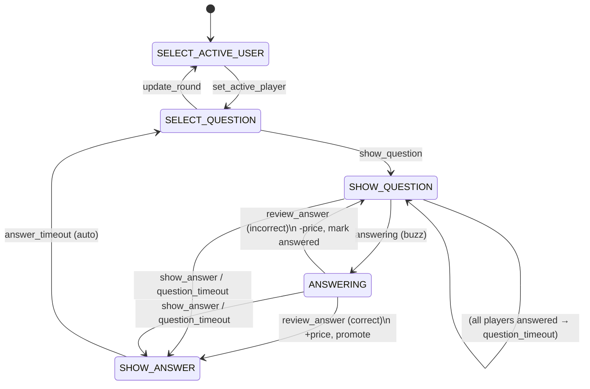

# Game Flow & Lifecycle

How a game goes from a `.siq` upload to a played-through quiz, and how the
server-authoritative state machine drives every turn.

## Architecture in one paragraph

The game is a **server-authoritative state machine** split into three layers so
the decision logic stays pure and testable:

- **`game/engine.py`** — pure decision logic. `decide(state, event, ctx)` returns
  a `Transition(next_state, effects)` or `Rejected(reason)`. No DB, no I/O.
- **`game/services.py`** — the only ORM layer. `apply_event(game_id, user_id, event, payload)`
  loads the `Game` with `select_for_update()` inside a transaction, computes the
  actor's roles, calls `engine.decide`, and applies the returned effects to the DB.
- **`game/consumers.py::GameConsumer`** — thin WebSocket transport. Maps an incoming
  message `type` to an engine event, calls `services.apply_event`, and broadcasts to
  the game group **only when the event is accepted**. Also runs the server-side
  countdown timers.

**Client contract:** the frontend (`context/GameContext.js`) opens one WebSocket
(`/ws/game/<id>/`) and, for most messages, **re-fetches full state over REST**
(`GET /game/api/<id>`). Only the timer messages (`question_time_left`,
`answer_time_left`) update local state directly. So the socket is largely a
"something changed, re-pull" signal.

## Lifecycle stages

### 1. Create
`POST /game/api/` with a SIGame `.siq` zip (multipart; `title`, `file`,
`max_player_count`, `password` — password is required).

- `parse_content_xml_from_zip` parses `content.xml` into nested
  `rounds → themes → questions` stored in `Game.data` (JSONField). Supports both
  the legacy `<atom>` layout and the v5 `<params>/<param><item>` layout.
- `parse_and_save_files_from_zip` extracts `Video/`, `Audio/`, `Images/`, `Html/`
  to `MEDIA_ROOT/<game_id>/{videos,audios,images,html}/`.
- The creator is `Game.creator`; they are **not** automatically a `Player`.

> ⚠️ Known gap: `Game.state` has no default, so a freshly created game starts with
> `state=''` and must be advanced (e.g. via `update_round`) before play begins.

### 2. Join
Players open `/game/join/<id>`, enter the room password → `PUT /game/api/join/<id>`
creates a `Player` and adds it to `Game.players`. The WebSocket consumer rejects
connections from non-members (`is_member` = creator or joined player).

### 3. Play
The in-game loop below, repeated per question until the pack is exhausted.

### 4. Round changes
The creator's round selector fires `update_round`, which resets players and returns
the game to `SELECT_ACTIVE_USER` for the new round.

## States

`Game.STATE_CHOICES` (mirrored as constants in `engine.py`):

| State | Meaning |
|---|---|
| `SELECT_ACTIVE_USER` | Creator picks which player is "active" (controls question selection). |
| `SELECT_QUESTION` | The board is shown; a question can be opened. |
| `SHOW_QUESTION` | A question is displayed; players may buzz in. |
| `ANSWERING` | A player has buzzed; the creator judges their answer. |
| `SHOW_ANSWER` | The answer is revealed; auto-advances back to selection. |
| `CAT_IN_A_BAG`, `RATE_QUESTION`, `FINAL` | Defined in `STATE_CHOICES` but not yet wired into engine rules. |

## Roles

Computed per actor by `services` from the loaded game, passed to the engine in `ctx.roles`:

- **`creator`** — `game.creator`; drives selection and judging.
- **`active_player`** — the player with `is_active=True`.
- **`responder`** — the player with `is_responder=True` (the one who buzzed).
- **`player`** — any joined member.

## Events & transitions

Each client message `type` maps to an engine event. Guards in parentheses; the
event is `Rejected` (no-op, no broadcast) if the guard fails.

| Event (`type`) | From state | → To state | Effects | Who |
|---|---|---|---|---|
| `set_active_player` | `SELECT_ACTIVE_USER` | `SELECT_QUESTION` | reset players, set active player | creator |
| `show_question` | `SELECT_QUESTION` (or creator/active player) | `SHOW_QUESTION` | clear responders, set active question (marks it completed) | creator / active player |
| `answering` | `SHOW_QUESTION` | `ANSWERING` | set responder | a player who can answer |
| `review_answer` (correct) | `ANSWERING` | `SHOW_ANSWER` | **+price** to responder, promote responder → active | creator |
| `review_answer` (incorrect) | `ANSWERING` | `SHOW_QUESTION` | **−price** to responder, mark them answered | creator |
| `show_answer` | `SHOW_QUESTION` / `ANSWERING` | `SHOW_ANSWER` | clear responders, clear answered | creator / player (manual reveal) |
| `question_timeout` | `SHOW_QUESTION` / `ANSWERING` | `SHOW_ANSWER` | clear responders, clear answered | server timer |
| `answer_timeout` | `SHOW_ANSWER` | `SELECT_QUESTION` | — | server timer |
| `update_round` | any | `SELECT_ACTIVE_USER` | reset players, set active round | creator |
| `update_score` | any | (unchanged) | set an exact score | creator |
| `join_player` | any | (unchanged) | broadcast only | any |

### State diagram

## Timers

Run by the consumer as tracked `asyncio` tasks (one per kind; restarting cancels the old one):

- **Question countdown** (`QUESTION_SECONDS`, 45s): started when a question is freshly
  shown (`show_question`). Ticks `question_time_left` to clients; on expiry — or when
  **all players have answered** — fires `question_timeout` → `SHOW_ANSWER`.
  **Skipped for interactive HTML questions** (`Game.is_active_question_html()`), which
  are host-paced — the creator reveals manually.
- **Answer countdown** (`ANSWER_SECONDS`, 5s): started on entering `SHOW_ANSWER`. Ticks
  `answer_time_left`; on expiry fires `answer_timeout` → `SELECT_QUESTION`.

## Scoring

Applied by effects when the creator judges in `ANSWERING`:

- **Correct** → `ScoreResponder(+price)` and `PromoteResponderToActive` (the responder
  becomes the active player and picks next).
- **Incorrect** → `ScoreResponder(-price)` and `MarkResponderAnswered` (they can't buzz
  again on this question); play returns to `SHOW_QUESTION` for others.
- The creator can also `update_score` to set an exact score at any time.

## Question content

Each question carries `question_content` and `answer_content` lists of
`{type, value}` items (plus `price`, `answer`, `completed`). Content types the
frontend renders:

| `type` | Render |
|---|---|
| `text` | text |
| `image` | `` from `/media/<id>/images/<value>` |
| `video` | `<video>` from `/media/<id>/videos/<value>` |
| `voice` | audio (`/media/<id>/audios/<value>`) with an audio icon |
| `html` | sandboxed `<iframe>` from `/media/<id>/html/<value>` — interactive mini-game, host-paced (no auto-timer; creator reveals) |

(SIGame item types are normalized during parsing: `audio → voice`, `say → text`.)
